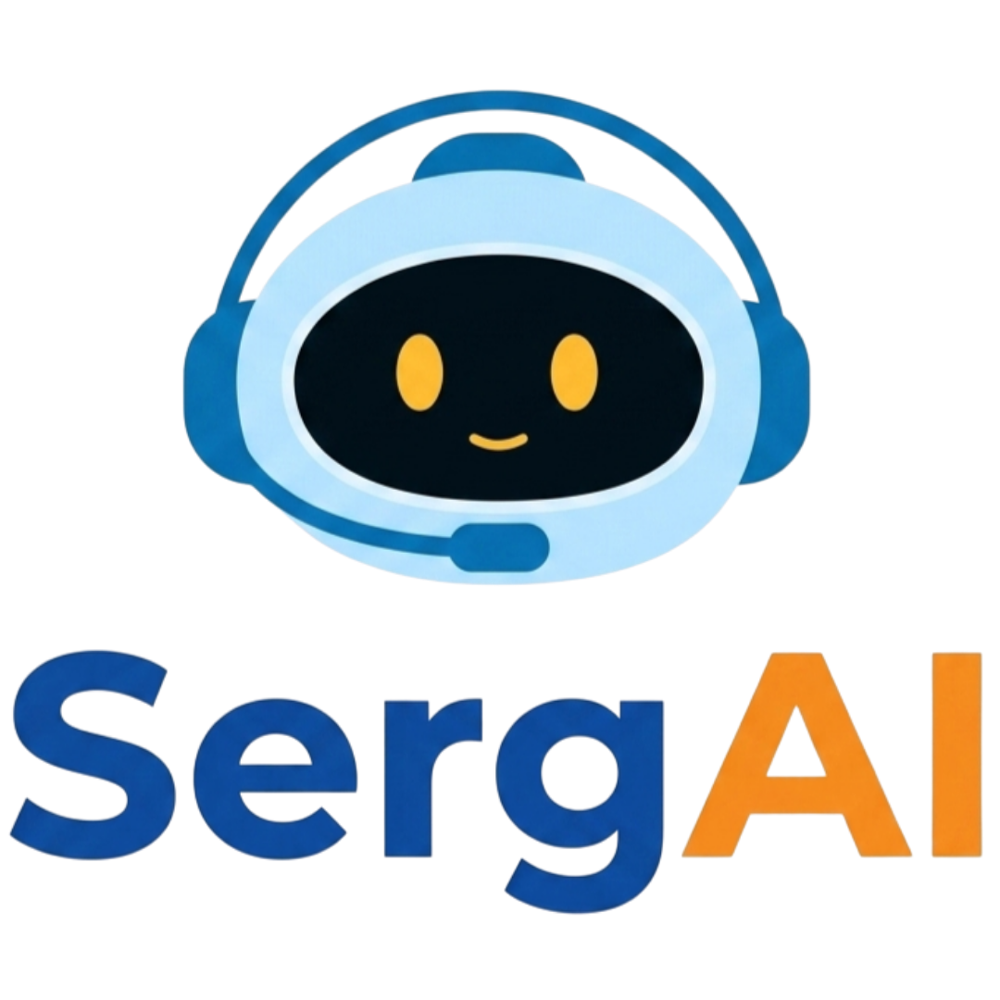

<p align="center">
  
</p>

<h1 align="center">SERGAI</h1>

<p align="center">
  <strong>Smart Engagement for Responsive Government Assistant Intelligence</strong>
</p>

<p align="center">
  Asisten virtual informasi statistik BPS Kabupaten Serdang Bedagai
</p>

---

## Tentang SERGAI

**SERGAI** adalah asisten virtual berbasis AI yang dibangun untuk membantu pengguna memperoleh informasi statistik Kabupaten Serdang Bedagai secara cepat, mudah, dan responsif.

SERGAI menggunakan pendekatan **Retrieval-Augmented Generation (RAG)** dengan menggabungkan proses pencarian data, knowledge base, dan Large Language Model (LLM).

---

## Fitur Utama

- Chatbot informasi statistik
- Pencarian data berdasarkan keyword
- Retrieval-Augmented Generation
- Integrasi LLM
- Penyajian tabel dan sumber data
- Tampilan responsif

---

## Arsitektur Sistem

```text
User
 ↓
Frontend
 ↓
FastAPI Backend
 ↓
RAGUnifiedModel
 ↓
Retrieval Data
 ↓
Context
 ↓
Gemini
 ↓
OpenAI Fallback
 ↓
Response
 ↓
Frontend
```

---

## Struktur Project

```text
SERGAI/
│
├── README.md
├── .env.example
├── .gitignore
├── requirements.txt
│
├── backend/
│   ├── config.py
│   ├── main.py
│   ├── test_rag_simple.py
│   │
│   └── models/
│       ├── __init__.py
│       ├── base.py
│       ├── gemini.py
│       ├── openai.py
│       └── rag_unified.py
│
└── frontend/
    ├── welcome.html
    ├── index.html
    │
    ├── assets/
    │   ├── logo-bps.png
    │   └── logo-sergAI.png
    │
    ├── css/
    │   ├── welcome.css
    │   └── style.css
    │
    └── js/
        ├── welcome.js
        ├── app.js
        ├── api.js
        └── config.js
```

---

## Backend

Backend menggunakan **FastAPI**.

File utama:

```text
backend/main.py
```

Model utama:

```text
backend/models/rag_unified.py
```

Alur backend:

```text
Pertanyaan User
      ↓
Keyword Matching
      ↓
Retrieval Data
      ↓
Context Building
      ↓
Gemini
      ↓
OpenAI Fallback
      ↓
Response
```

---

## Frontend

Frontend menggunakan:

- HTML
- CSS
- JavaScript

Halaman utama:

```text
welcome.html → Landing Page
index.html   → Chatbot
```

---

## Menjalankan Project

Install dependency:

```bash
pip install -r requirements.txt
```

Jalankan backend:

```bash
uvicorn backend.main:app --reload
```

Kemudian buka aplikasi pada browser.

---

## Environment Variable

Gunakan file:

```text
.env
```

untuk menyimpan API key dan konfigurasi sensitif.

Contoh:

```env
GEMINI_API_KEY=your_key
OPENAI_API_KEY=your_key
```

Jangan upload `.env` ke repository.

---

## BPS Kabupaten Serdang Bedagai

SERGAI dikembangkan untuk mendukung peningkatan aksesibilitas informasi statistik di BPS Kabupaten Serdang Bedagai.

<p align="center">
  © 2026 BPS Kabupaten Serdang Bedagai
</p>
